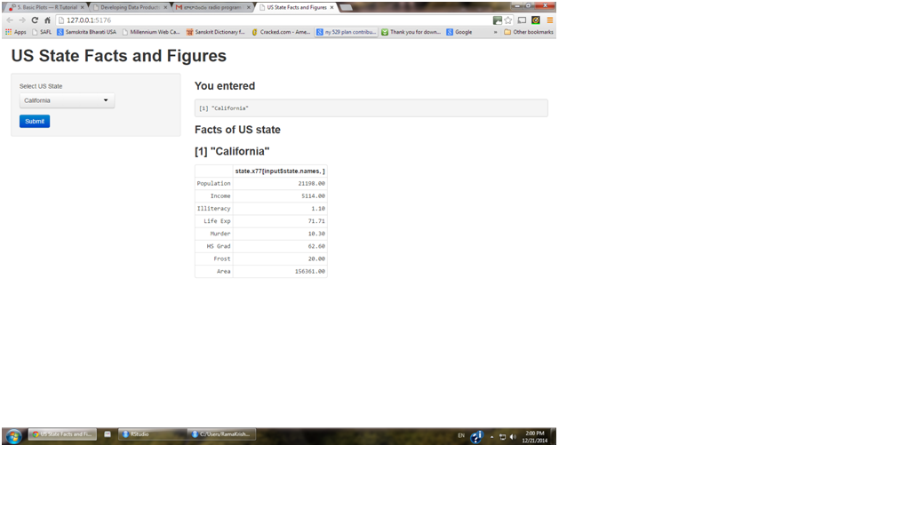

Shiny App Presentation
========================================================
author: OrKay
date: December 21 2014
transition: rotate

Presentation of Shiny Application Course Project
=================================================

## Synopsis

This project work involves developing a shiny application which accepts US state
as input from the user, filters the dataset **state.x77** and presents the facts
about the selected state from the filtered dataset.

It fullfills the following requirements: 

1. It uses selectInput widget to let the user input/select a state.
2. The sever.R code utilizes the selected state to filter dataset.
3. The server returns the filtered dataset and ui.R contains the code to display the results.
4. The work includes the documentation describing the application.

- server.R
- ui.R
- README.RMD, README.MD and README.html

2 Data Processing
==================

The dataset **state.x77** that comes with R is used to build this shiny app.


```r
summary(state.x77)
```

```
   Population        Income       Illiteracy       Life Exp    
 Min.   :  365   Min.   :3098   Min.   :0.500   Min.   :67.96  
 1st Qu.: 1080   1st Qu.:3993   1st Qu.:0.625   1st Qu.:70.12  
 Median : 2838   Median :4519   Median :0.950   Median :70.67  
 Mean   : 4246   Mean   :4436   Mean   :1.170   Mean   :70.88  
 3rd Qu.: 4968   3rd Qu.:4814   3rd Qu.:1.575   3rd Qu.:71.89  
 Max.   :21198   Max.   :6315   Max.   :2.800   Max.   :73.60  
     Murder          HS Grad          Frost             Area       
 Min.   : 1.400   Min.   :37.80   Min.   :  0.00   Min.   :  1049  
 1st Qu.: 4.350   1st Qu.:48.05   1st Qu.: 66.25   1st Qu.: 36985  
 Median : 6.850   Median :53.25   Median :114.50   Median : 54277  
 Mean   : 7.378   Mean   :53.11   Mean   :104.46   Mean   : 70736  
 3rd Qu.:10.675   3rd Qu.:59.15   3rd Qu.:139.75   3rd Qu.: 81163  
 Max.   :15.100   Max.   :67.30   Max.   :188.00   Max.   :566432  
```

3 Slide With Plot
========================

 

4 How does the Shiny App work
==============================


This Shiny App provides list of states in the drop down, 
allowing user to select a state and click submit button to get the facts 
related to the selected state. Once user clicks the submit button, the data 
from the **state.x77** dataset will be filtered and displayed in the UI.


5 ui.R Code
===========

### This is ui.R code


```r
library(shiny)     
shinyUI(
        pageWithSidebar(
                # Application title
                headerPanel("US State Facts and Figures"),
                sidebarPanel(
                        uiOutput("choose_state"),
                        submitButton('Submit')
                ),
                mainPanel(                        
                        h3('You entered'),
                        verbatimTextOutput("inputValue"),
                        h3('Facts of US state '),
                        h3(textOutput("selected.state")),
                        tableOutput("state.facts")
                )
        )
)
```

<!--html_preserve--><div class="container-fluid">
<div class="row-fluid">
<div class="span12" style="padding: 10px 0px;">
<h1>US State Facts and Figures</h1>
</div>
</div>
<div class="row-fluid">
<div class="span4">
<form class="well">
<div id="choose_state" class="shiny-html-output"></div>
<div>
<button type="submit" class="btn btn-primary">Submit</button>
</div>
</form>
</div>
<div class="span8">
<h3>You entered</h3>
<pre id="inputValue" class="shiny-text-output"></pre>
<h3>Facts of US state </h3>
<h3>
<div id="selected.state" class="shiny-text-output"></div>
</h3>
<div id="state.facts" class="shiny-html-output"></div>
</div>
</div>
</div><!--/html_preserve-->

6 server.R Code
================

### This is server.R code


```r
library(datasets)

shinyServer(
        function(input, output) {
                
                # Drop-down selection box for which data set
                output$choose_state <- renderUI({
                        selectInput("state.names", "Select US State", as.list(row.names(state.x77)))
                })
                
                output$inputValue <- renderPrint({input$state.names})
                output$selected.state <- renderPrint({input$state.names})
                output$state.facts <- renderTable({
                        # If missing input, return to avoid error later in function
                        if(is.null(input$state.names))
                                return()
                        as.data.frame(state.x77[input$state.names,])
                })

        }
)
```

7 Shiny App UI
==============


